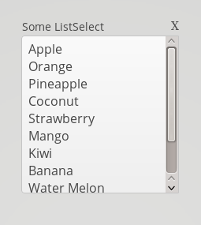

# ResetButtonForListSelect Add-on for Vaadin 7

The ResetButtonForListSelect is a Vaadin extension Add-on which adds a reset button to the caption of a ListSelect class.
This reset-button will set the value of the extended ListSelect to "null" (via the setValue() method, so also fires valueChangeListeners if registered).

Since the extension adds the reset button to the caption, this Add-on only works, when the extended ListSelect has a caption set before initialy rendered to the screen.



## Online demo

Try the add-on demo at http://bonprix.jelastic.servint.net/resetbutton-for-listselect-demo/

## Download release

Official releases of this add-on are available at Vaadin Directory. For Maven instructions, download and reviews, go to http://vaadin.com/addon/resetbutton-for-listselect

## Usage

```Java
		final ListSelect listSelect = new ListSelect("Some ListSelect", Arrays.asList("Apple", "Orange", "Pineapple", "Coconut", "Strawberry", "Mango", "Kiwi",
		        "Banana", "Water Melon", "Lemon fruit", "Date"));

		ResetButtonForListSelect.extend(listSelect);

```

## Building and running demo

git clone https://github.com/bonprix/resetbutton-for-listselect
mvn clean install
cd demo
mvn jetty:run

To see the demo, navigate to http://localhost:8080/

## Development with Eclipse IDE

For further development of this add-on, the following tool-chain is recommended:
- Eclipse IDE
- m2e wtp plug-in (install it from Eclipse Marketplace)
- Vaadin Eclipse plug-in (install it from Eclipse Marketplace)
- JRebel Eclipse plug-in (install it from Eclipse Marketplace)
- Chrome browser

 
## Release notes

### Version 1.0.0

- initial version, added the reset-button

## Roadmap

This has no further roadmap so far.

## Issue tracking

The issues for this add-on are tracked on its github.com page. All bug reports and feature requests are appreciated. 

## Contributions

Contributions are welcome, but there are no guarantees that they are accepted as such. Process for contributing is the following:
- Fork this project
- Create an issue to this project about the contribution (bug or feature) if there is no such issue about it already. Try to keep the scope minimal.
- Develop and test the fix or functionality carefully. Only include minimum amount of code needed to fix the issue.
- Refer to the fixed issue in commit
- Send a pull request for the original project
- Comment on the original issue that you have implemented a fix for it

## License & Author

Add-on is distributed under Apache License 2.0. For license terms, see LICENSE.txt.

MyComponent is written by Bonprix Handelsges. mbH

Developers:
- Christian Thiel (https://github.com/stoerti)
